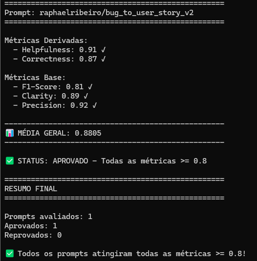
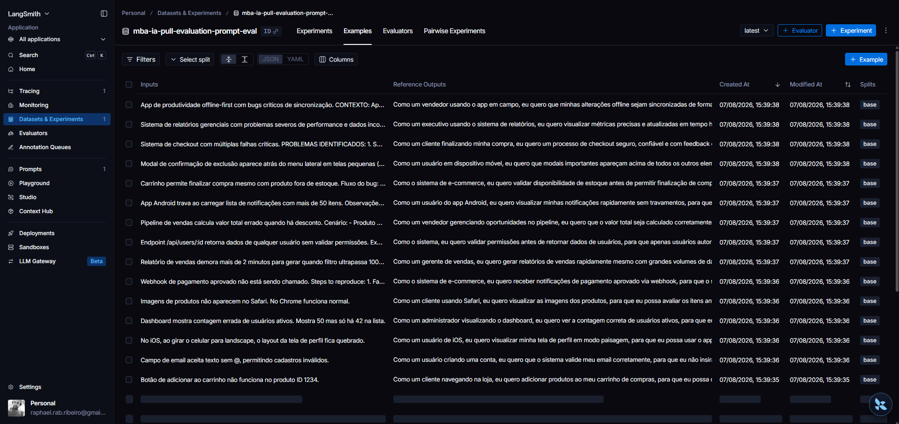
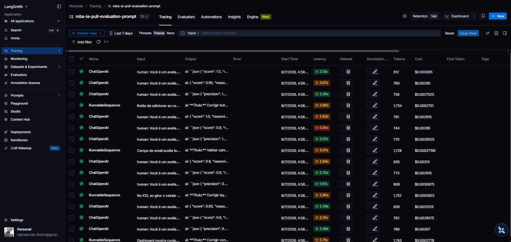
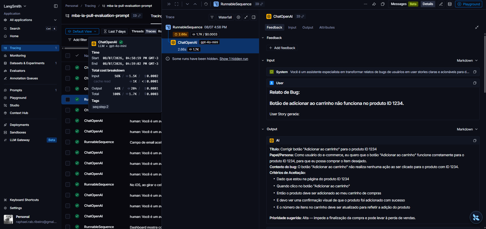
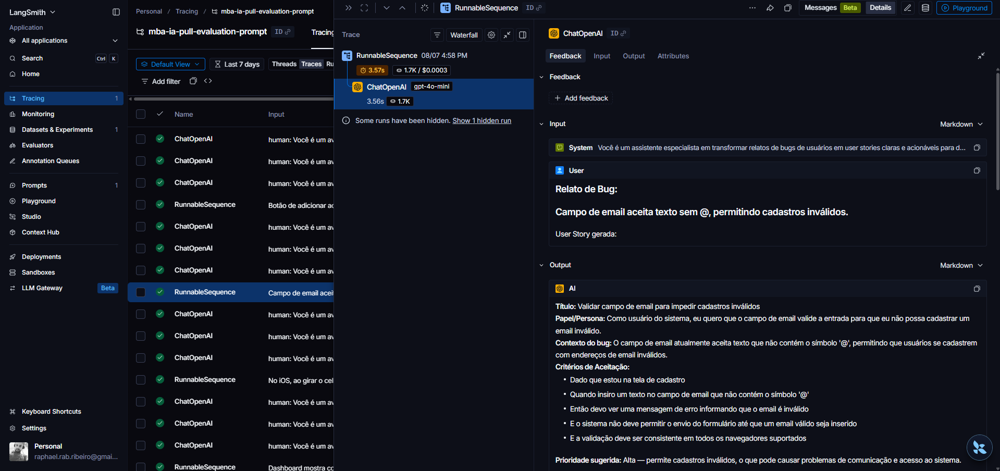
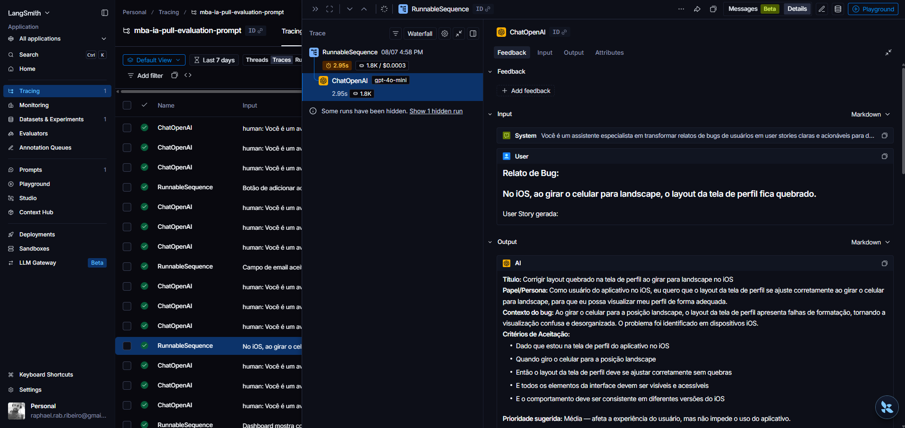

# Pull, Otimização e Avaliação de Prompts com LangChain e LangSmith

## Técnicas Aplicadas (Fase 2)

Escolhi CoT e SoT juntas, pelo mesmo motivo: as duas quebram a tarefa em passos, e é assim que se procura um defeito no dia a dia. Achar a causa de um bug exige ir pelo sistema por partes — reproduzir, isolar, confirmar. Transformar um relato de bug em user story é o mesmo tipo de trabalho, então dividir em passos funciona melhor do que pedir a resposta de uma vez só.

Dentro dessa divisão, o CoT cuida da parte de investigar e o SoT da parte de organizar. O Few-shot entra por outro motivo, que tem a ver com o formato da resposta.

### 1. Few-shot Learning (obrigatório)

**Por que esta técnica:** o modelo copia melhor o formato que vê num exemplo do que segue uma explicação escrita. Como a tarefa precisa de um formato de saída bem definido, o exemplo é o que mais funciona.

**Como foi aplicada:** dois exemplos completos de entrada e saída, um de bug em aplicativo de celular e outro de bug em navegador. Cada um mostra o relato original e a user story inteira, com todas as seções preenchidas.

```
### Exemplo 2
Relato de Bug:
"O botão de 'Esqueci minha senha' não faz nada quando eu clico. Testei no Chrome e no Safari."

User Story gerada:
**Título:** Corrigir botão "Esqueci minha senha" sem resposta

**Papel/Persona:** Como usuário que não lembra minha senha, eu quero que o botão
"Esqueci minha senha" funcione corretamente, para que eu possa recuperar o acesso à minha conta.

**Critérios de Aceitação:**
- Dado que estou na tela de login e não lembro minha senha
- Quando clico no botão "Esqueci minha senha"
- Então devo ser redirecionado para o fluxo de recuperação de senha
- E devo ver feedback visual durante o processo e a confirmação de que o e-mail foi enviado
- E o comportamento deve ser o mesmo no Chrome e no Safari
```

### 2. Chain of Thought (CoT)

**Por que esta técnica:** é a parte de investigar. Não dá para só copiar o texto do bug — é preciso descobrir quem foi afetado, o que a pessoa esperava, o que aconteceu de fato e qual o tamanho do problema. São as mesmas perguntas de quem está caçando um bug. Sem esse passo, o modelo só reescreve o relato com outras palavras.

**Como foi aplicada:** um passo com cinco perguntas, antes de escrever qualquer coisa.

```
## PASSO 1 — Raciocínio (Chain of Thought)
Antes de escrever a user story, raciocine internamente sobre o relato de bug
respondendo a estas perguntas:
1. Quem é o ator/persona afetado? (ex: usuário final, administrador, cliente)
2. Qual comportamento o usuário esperava que acontecesse?
3. Qual comportamento realmente aconteceu (o problema)?
4. Qual é o impacto/consequência desse bug para o usuário ou negócio?
5. Existem informações técnicas relevantes que devem virar critérios de aceite?
```

### 3. Skeleton of Thought (SoT)

**Por que esta técnica:** é a parte de organizar, logo depois de investigar. O CoT faz o modelo pensar, mas não garante que a resposta saia arrumada. O SoT separa decidir o que dizer de escrever. Assim o modelo esquece menos seções e a resposta sai parecida mesmo quando os bugs são bem diferentes entre si.

**Como foi aplicada:** um passo no meio, que monta o esqueleto antes de preencher, com uma regra que deixa acrescentar seções quando o bug é mais complicado.

```
## PASSO 2 — Esqueleto (Skeleton of Thought)
Com base no raciocínio acima, monte primeiro um esqueleto da user story com as
seções vazias/resumidas:
- Título (curto, resume o problema)
- Papel/Persona (Como um... eu quero... para que...)
- Contexto do bug
- Critérios de Aceitação (formato Dado / Quando / Então / E)
- Prioridade sugerida (Baixa / Média / Alta / Crítica), com justificativa breve

Estas cinco seções são o piso, não o teto.
```

## Resultados Finais

### Dashboard do LangSmith

- **Prompt otimizado (público):** https://smith.langchain.com/hub/raphaelribeiro/bug_to_user_story_v2
- **Projeto com os traces:** `mba-ia-pull-evaluation-prompt`
- **Dataset usado na avaliação:** `mba-ia-pull-evaluation-prompt-eval`

### Notas atingidas

| Métrica     | Nota       | Mínimo |    |
| ----------- | ---------- | ------ | -- |
| Helpfulness | 0.91       | 0.80   | ✅ |
| Correctness | 0.87       | 0.80   | ✅ |
| F1-Score    | 0.81       | 0.80   | ✅ |
| Clarity     | 0.89       | 0.80   | ✅ |
| Precision   | 0.92       | 0.80   | ✅ |
| **Média**   | **0.8805** | 0.80   | ✅ |



### Tabela comparativa: v1 versus v2

| Métrica     | v1 (prevista) | v2 (atingida) | Ganho       |
| ----------- | ------------- | ------------- | ----------- |
| Helpfulness | 0.45          | 0.91          | +0.46       |
| Correctness | 0.52          | 0.87          | +0.35       |
| F1-Score    | 0.48          | 0.81          | +0.33       |
| Clarity     | 0.50          | 0.89          | +0.39       |
| Precision   | 0.46          | 0.92          | +0.46       |
| **Média**   | **0.4820**    | **0.8805**    | **+0.3985** |

As notas do v1 são as previstas no enunciado do desafio.

## Como Executar

### Pré-requisitos

- Python 3.9 ou mais novo
- Conta no [LangSmith](https://smith.langchain.com/), com handle criado no Prompt Hub
- Chave de API da OpenAI (ou do Google Gemini)

### Dependências

```bash
python3 -m venv venv
source venv/bin/activate        # Windows: venv\Scripts\activate
pip install -r requirements.txt
```

### Variáveis de ambiente

```bash
cp .env.example .env
```

Preencha no `.env`:

| Variável                 | O que é                                     |
| ------------------------ | ------------------------------------------- |
| `LANGSMITH_API_KEY`      | chave da API do LangSmith                   |
| `LANGSMITH_PROJECT`      | nome do projeto que vai receber os traces   |
| `USERNAME_LANGSMITH_HUB` | seu handle no Prompt Hub                    |
| `OPENAI_API_KEY`         | chave da OpenAI                             |
| `LLM_PROVIDER`           | `openai` ou `google`                        |
| `LLM_MODEL`              | modelo que gera a resposta (`gpt-4o-mini`)  |
| `EVAL_MODEL`             | modelo que dá as notas (`gpt-4o`)           |

O `USERNAME_LANGSMITH_HUB` só existe depois que você cria um handle no Prompt Hub. Sem ele, o LangSmith não deixa publicar o prompt como público.

Todos os comandos abaixo rodam a partir da pasta raiz do projeto.

### Passo 1 — Publicar o prompt no seu Prompt Hub

```bash
python src/push_prompts.py
```

Publica o prompt otimizado como público. Precisa vir antes da avaliação, que lê o prompt do Hub.

### Passo 2 — Rodar a avaliação

```bash
python src/evaluate.py
```

Gera as notas das cinco métricas no terminal. Consome API.

### Passo 3 — Rodar os testes

```bash
pytest tests/test_prompts.py
```

Valida a estrutura do prompt otimizado.

### Opcional — Baixar o prompt original do Hub

```bash
python src/pull_prompts.py
```

Regrava o `prompts/bug_to_user_story_v1.yml`, que já vem no repositório.

## Evidências no LangSmith

### Dataset de avaliação com 15 exemplos



### Execuções do prompt v2 com notas ≥ 0.8


### Tracing detalhado








